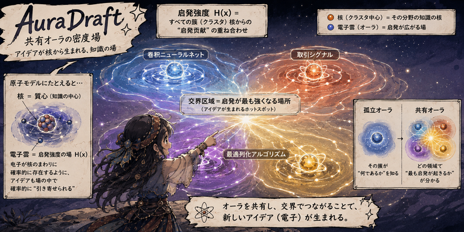

# AuraDraft

<p align="center">
  
</p>

<p align="center">
  <b>Knowledge that breathes.</b><br>
  A knowledge base where clusters are planets of meaning, surrounded by a shared inspiration field — the Aura.
</p>

---

## What is AuraDraft?

AuraDraft is a token-based knowledge base engine with a two-level architecture:

- **Planets (clusters):** Stable cores of meaning. Each cluster is a self-organizing group of documents, represented by an L2-normalized TF-IDF centroid in token space.
- **Aura (shared inspiration field):** A continuous density field that permeates the space between clusters. It is densest at the *boundaries* between clusters — the places where cross-domain inspiration is most likely to occur.

The key insight: **inspiration doesn't live inside a cluster. It lives in the gaps between them.**

A token that belongs equally to "convolutional architectures" and "trading signals" has high Aura intensity — it sits in the interstitial zone where new ideas form. AuraDraft makes these zones visible.

## Architecture

### Two layers of meaning

```
                    ┌─────────────────────────────┐
                    │      Shared Aura Field        │
                    │   (inspiration density)       │
                    │                               │
         ┌───────╔╧════════╗────────┐               │
         │       ║ Planet A ║        │  ← boundary  │
         │       ║ (core)   ║   ╔════╧════╗         │
         │       ╚══════╤═══╝   ║ Planet B ║         │
         │              │       ║ (core)   ║         │
         │              │       ╚══════╤═══╝         │
         │              │              │              │
                    └───┴──────────────┴──────────────┘

                    Aura is densest at boundaries
```

**Planet (cluster core):** What you already know. Stable. Document TF-IDF centroids in token space.

**Aura (inspiration field):** What you *might* discover. Fluid. Concentrated at inter-cluster boundaries where entropy of belonging is highest.

### Three-layer token index

All documents are tokenized using tiktoken's `o200k_base` (GPT-4o's tokenizer), chunked (256 tokens, 32 overlap), and indexed in three layers:

| Layer | What | Purpose |
|-------|------|---------|
| Layer 1 | Token inverted index | BM25 scoring (K1=1.2, B=0.75) |
| Layer 2 | Bigram phrase index | Deterministic phrase matching |
| Layer 3 | Packed chunk tokens | Full-text reconstruction from binary blobs |

### MoE routing (two-level classification)

- **L0 (free, milliseconds):** Token frequency signature → cosine similarity against cluster centroids → Top-K candidates
- **L1 (LLM, tokens):** Agent reads Top-K knowledge cards → semantic judgment → assign or create
- **Scales to 10,000+ clusters** with bounded compute

### The Aura field

The inspiration intensity at any point `p` in the space is:

```
H(p) = concentration(p) × entropy(p)
```

Where:
- `concentration(p) = Σ exp(-||p - c_i||² / 2σ²)`  — total affinity from all clusters
- `entropy(p) = -Σ q_i(p) log q_i(p)`  — Shannon entropy of the belonging distribution

**Why this works:**

| Position | Concentration | Entropy | H(p) | Meaning |
|----------|--------------|---------|------|---------|
| Cluster center | High | Low | Medium | Already known — low surprise |
| **Boundary** | **High** | **High** | **Maximum** | **Cross-domain inspiration zone** |
| Far empty space | Low | Medium | Low | No information to spark from |

Tokens are weighted by their cross-cluster entropy: a token appearing in multiple cluster centroids has high Aura weight and drifts toward boundaries. Tokens in a single cluster have zero Aura weight and sink into their planet.

```
token_aura_weight(t) = total_strength(t) × cross_cluster_entropy(t)
```

## 8 Atomic Tools

All tools via CLI: `"$SKILL_DIR/bin/kb" <cmd> <args>`

| Tool | Purpose | LLM call |
|------|---------|:--------:|
| `kb_ingest` | Index a document (tokenize + chunk + 3-layer index) | ❌ |
| `kb_prefilter` | Statistical screening (token signature → cosine similarity → Top-K) | ❌ |
| `kb_get_cards` | Read knowledge cards for clusters | ❌ |
| `kb_assign` | Assign document to existing cluster (updates centroid + card) | ❌ |
| `kb_create` | Create new cluster (label + card + first document) | ❌ |
| `kb_update_card` | Update a cluster's knowledge card | ❌ |
| `kb_search` | BM25 hybrid retrieval (0.6×exact + 0.4×phrase) | ❌ |
| `kb_archive` | Physical archiving to `knowledge_base/{label}/` | ❌ |

### Standard workflow

```bash
# 1. Index
"$SKILL_DIR/bin/kb" ingest paper.pdf doc_001

# 2. Prefilter — find candidate clusters
"$SKILL_DIR/bin/kb" prefilter doc_001

# 3. Agent reads cards → decides: assign or create
cat card.txt | "$SKILL_DIR/bin/kb" assign doc_001 <cluster_id>
# or
cat card.txt | "$SKILL_DIR/bin/kb" create "New Domain" doc_001

# 4. Archive
"$SKILL_DIR/bin/kb" archive paper.pdf "New Domain" doc_001
```

### Query

```bash
"$SKILL_DIR/bin/kb" search "attention mechanism complexity"
# → [{doc_id: "dl_001", score: 15.81}, ...]
```

## Installation

> **`$SKILL_DIR`** = the directory containing this README. No hardcoded paths anywhere.

```bash
bash setup.sh
```

Creates `$SKILL_DIR/.venv`, installs dependencies (tiktoken, numpy, optional pymupdf for PDF). Auto-detects PyPI mirrors and proxy. Python ≥ 3.10 required (override with `KB_AGENT_PYTHON`).

```bash
"$SKILL_DIR/bin/kb" <cmd> <args>      # CLI wrapper (strips PYTHONPATH pollution)
"$SKILL_DIR/bin/kb-python" <script>   # Python wrapper for batch scripts
```

### Hermes Agent registration

```bash
ln -s /path/to/auradraft ~/.hermes/skills/data-science/kb-agent
```

Then load in a Hermes conversation: the skill auto-registers its 8 tools.

## Visualization

### Bubble view (interactive D3 force-directed map)

```bash
"$SKILL_DIR/bin/kb-python" "$SKILL_DIR/visualize.py" --mode bubble
# → ~/.kb-agent/bubble.html
```

Each cluster is a draggable bubble. Bubble size = document count. Top-20 tokens float inside. Inter-cluster links show cosine similarity.

### Cards view (static summary)

```bash
"$SKILL_DIR/bin/kb-python" "$SKILL_DIR/visualize.py" --mode cards
# → ~/.kb-agent/visualization.html
```

### Live refresh (zero infrastructure)

```bash
"$SKILL_DIR/bin/kb-python" "$SKILL_DIR/visualize.py" --mode bubble --refresh-interval 5
# Then open in Hermes preview pane or any browser
```

## Data storage

| Data | Location | Notes |
|------|----------|-------|
| Index + clusters | `kb_index.db` (default `~/.kb-agent/`) | SQLite, WAL mode |
| Archived files | `knowledge_base/{label}/` | Copies, originals preserved |
| Token cache | `.cache/tiktoken/` | BPE file cache |

## Design decisions

### Why token indexing instead of word-level or vector?

- **No separate tokenizer needed** — sub-word granularity is native
- **Aligned with LLM** — index and inference operate in the same token space
- **Integer ID lookups** — an order of magnitude faster than string matching
- **Token budget awareness** — chunks know their token cost

### Why MoE routing?

With 10,000 clusters, you can't fit all knowledge cards in an LLM context. MoE solves this:

- **L0 (statistical):** Token frequency → cosine similarity → Top-K candidates (free, ms)
- **L1 (LLM):** Only Top-K cards enter the prompt → agent makes the final call
- **Same principle as sparse MoE models:** unlimited capacity × bounded compute

### Why the Aura field?

Traditional knowledge bases optimize for *finding what you already know*. AuraDraft optimizes for *discovering what you don't know you know*.

The Aura field surfaces the interstitial zones — the boundaries between knowledge clusters where:
- A concept from domain A illuminates domain B
- Two fields share a hidden vocabulary
- The most generative collisions happen

It's not retrieval. It's **inspiration made visible.**

## Project structure

```
auradraft/
├── src/kb_agent/
│   ├── tokenizer/canonical.py   # Canonical tokenizer (o200k_base)
│   ├── document/loader.py       # Document loader (text, PDF, markdown)
│   ├── index/engine.py          # Token index engine (BM25, 3-layer)
│   ├── cluster/
│   │   ├── model.py             # KnowledgeCluster data model
│   │   └── manager.py           # TokenClusterEngine (TF-IDF clustering)
│   ├── router/moe_router.py     # MoE router (L0 prefilter + L1 LLM)
│   ├── storage/
│   │   ├── db.py                # SQLite connection + schema
│   │   └── cluster_store.py     # Cluster persistence
│   └── tools/
│       ├── session.py           # KnowledgeBaseSession
│       ├── ops.py               # 8 atomic tools
│       └── cli.py               # CLI entry point
├── visualize.py                 # D3 bubble/cards visualization
├── scripts/                     # Batch ingest, auto-refresh
├── docs/                        # Hero image, assets
├── tests/
├── SKILL.md                     # Hermes skill manifest
├── pyproject.toml
└── README.md
```

## Milestones

| Milestone | Features | Status |
|-----------|----------|--------|
| M1 | Token index engine (BM25 + persistence) | ✅ |
| M2 | Statistical clustering (noise filter + TF-IDF + cosine) | ✅ |
| M3 | MoE routing (knowledge cards + L0/L1) | ✅ |
| M4 | Query pipeline (BM25 + cluster navigation) | ✅ |
| M5 | CLI + physical archiving + batch ingest | ✅ |
| **v2.0** | **Aura field: shared inspiration density model** | 🔬 Concept |

## Pitfalls

- **CLI cold start ~2s** — tiktoken BPE loading. Use Python scripts for batch.
- **`kb_ingest` requires `kb_assign` or `kb_create`** — otherwise document has index but no cluster, invisible to search.
- **`kb_archive` copies, doesn't move** — source files are preserved.
- **SQLite file locks** — don't run multiple CLI commands on the same DB concurrently.
- **`kb_prefilter` returns all clusters when count ≤ top_k** — no similarity threshold.

## License

MIT
